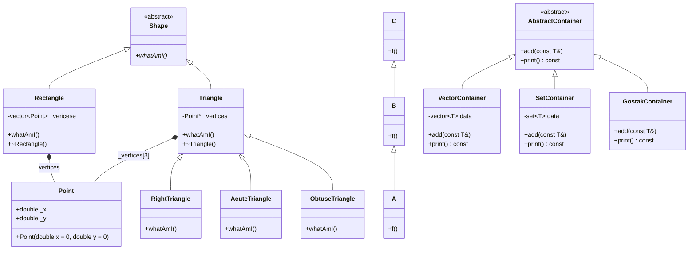

# 00 Shape Class Diagram

```mermaid
classDiagram
    class Point {
        +double _x
        +double _y
        +Point(double x = 0, double y = 0)
    }

    class Shape {
        <<abstract>>
        +whatAmI()*
    }

    class Rectangle {
        -vector~Point~ _vericese
        +whatAmI()
        +~Rectangle()
    }

    class Triangle {
        -Point* _vertices
        +whatAmI()
        +~Triangle()
    }

    class RightTriangle {
        +whatAmI()
    }

    class AcuteTriangle {
        +whatAmI()
    }

    class ObtuseTriangle {
        +whatAmI()
    }

    class C {
        +f()
    }

    class B {
        +f()
    }

    class A {
        +f()
    }

    class AbstractContainer {
        <<abstract>>
        +add(const T&)
        +print() const
    }

    class VectorContainer {
        -vector~T~ data
        +add(const T&)
        +print() const
    }

    class SetContainer {
        -set~T~ data
        +add(const T&)
        +print() const
    }

    class GostakContainer {
        +add(const T&)
        +print() const
    }

    Shape <|-- Rectangle
    Shape <|-- Triangle
    Triangle <|-- RightTriangle
    Triangle <|-- AcuteTriangle
    Triangle <|-- ObtuseTriangle
    Rectangle *-- Point : vertices
    Triangle *-- Point : _vertices[3]

    C <|-- B
    B <|-- A

    AbstractContainer <|-- VectorContainer
    AbstractContainer <|-- SetContainer
    AbstractContainer <|-- GostakContainer
```
