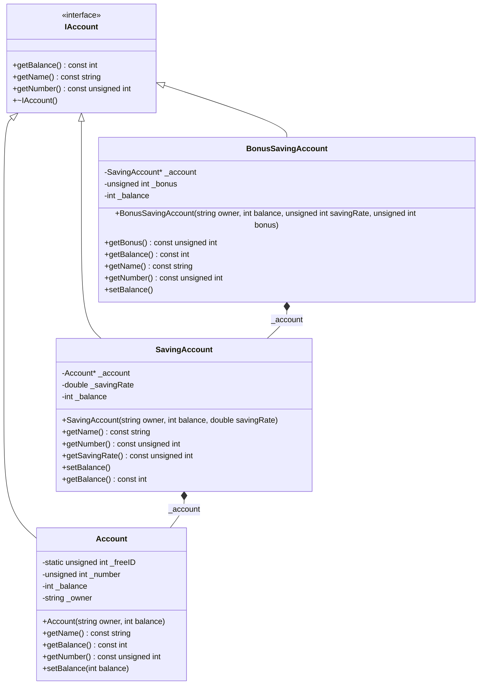

# 01 IAccount Class Diagram

```mermaid
classDiagram
    class IAccount {
        <<interface>>
        +getBalance() const int
        +getName() const string
        +getNumber() const unsigned int
        +~IAccount()
    }

    class Account {
        -static unsigned int _freeID
        -unsigned int _number
        -int _balance
        -string _owner
        +Account(string owner, int balance)
        +getName() const string
        +getBalance() const int
        +getNumber() const unsigned int
        +setBalance(int balance)
    }

    class SavingAccount {
        -Account* _account
        -double _savingRate
        -int _balance
        +SavingAccount(string owner, int balance, double savingRate)
        +getName() const string
        +getNumber() const unsigned int
        +getSavingRate() const unsigned int
        +setBalance()
        +getBalance() const int
    }

    class BonusSavingAccount {
        -SavingAccount* _account
        -unsigned int _bonus
        -int _balance
        +BonusSavingAccount(string owner, int balance, unsigned int savingRate, unsigned int bonus)
        +getBonus() const unsigned int
        +getBalance() const int
        +getName() const string
        +getNumber() const unsigned int
        +setBalance()
    }

    IAccount <|-- Account
    IAccount <|-- SavingAccount
    IAccount <|-- BonusSavingAccount
    SavingAccount *-- Account : _account
    BonusSavingAccount *-- SavingAccount : _account
```
