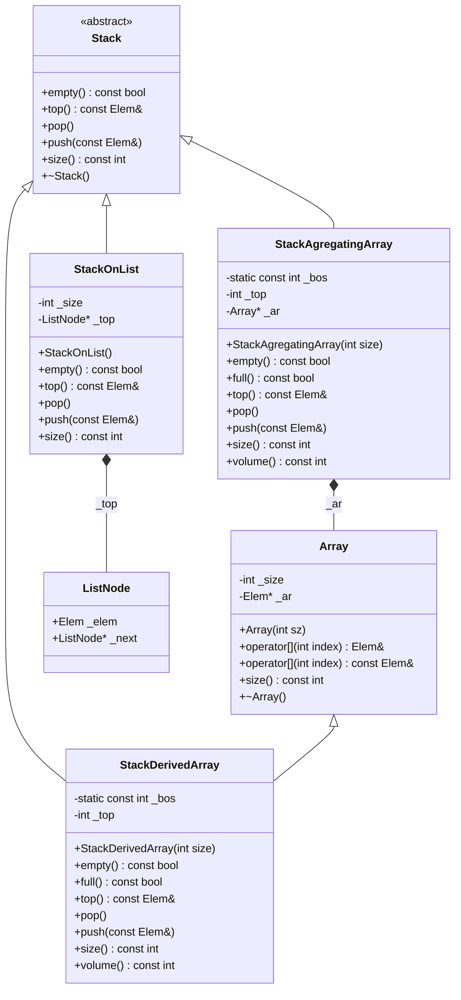

# 1.Stack Class Diagram

```mermaid
classDiagram
    class Stack {
        <<abstract>>
        +empty() const bool
        +top() const Elem&
        +pop()
        +push(const Elem&)
        +size() const int
        +~Stack()
    }

    class Array {
        -int _size
        -Elem* _ar
        +Array(int sz)
        +operator[](int index) Elem&
        +operator[](int index) const Elem&
        +size() const int
        +~Array()
    }

    class StackAgregatingArray {
        -static const int _bos
        -int _top
        -Array* _ar
        +StackAgregatingArray(int size)
        +empty() const bool
        +full() const bool
        +top() const Elem&
        +pop()
        +push(const Elem&)
        +size() const int
        +volume() const int
    }

    class StackDerivedArray {
        -static const int _bos
        -int _top
        +StackDerivedArray(int size)
        +empty() const bool
        +full() const bool
        +top() const Elem&
        +pop()
        +push(const Elem&)
        +size() const int
        +volume() const int
    }

    class StackOnList {
        -int _size
        -ListNode* _top
        +StackOnList()
        +empty() const bool
        +top() const Elem&
        +pop()
        +push(const Elem&)
        +size() const int
    }

    class ListNode {
        +Elem _elem
        +ListNode* _next
    }

    Stack <|-- StackAgregatingArray
    Stack <|-- StackDerivedArray
    Stack <|-- StackOnList
    Array <|-- StackDerivedArray
    StackAgregatingArray *-- Array : _ar
    StackOnList *-- ListNode : _top
```
