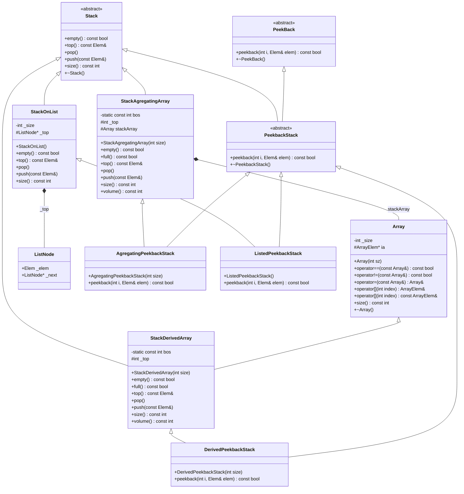

# 2.PeekBacklStack Class Diagram

```mermaid
classDiagram
    class Stack {
        <<abstract>>
        +empty() const bool
        +top() const Elem&
        +pop()
        +push(const Elem&)
        +size() const int
        +~Stack()
    }

    class PeekBack {
        <<abstract>>
        +peekback(int i, Elem& elem) const bool
        +~PeekBack()
    }

    class PeekbackStack {
        <<abstract>>
        +peekback(int i, Elem& elem) const bool
        +~PeekbackStack()
    }

    class Array {
        -int _size
        #ArrayElem* ia
        +Array(int sz)
        +operator==(const Array&) const bool
        +operator!=(const Array&) const bool
        +operator=(const Array&) Array&
        +operator[](int index) ArrayElem&
        +operator[](int index) const ArrayElem&
        +size() const int
        +~Array()
    }

    class StackAgregatingArray {
        -static const int bos
        #int _top
        #Array stackArray
        +StackAgregatingArray(int size)
        +empty() const bool
        +full() const bool
        +top() const Elem&
        +pop()
        +push(const Elem&)
        +size() const int
        +volume() const int
    }

    class StackDerivedArray {
        -static const int bos
        #int _top
        +StackDerivedArray(int size)
        +empty() const bool
        +full() const bool
        +top() const Elem&
        +pop()
        +push(const Elem&)
        +size() const int
        +volume() const int
    }

    class StackOnList {
        -int _size
        #ListNode* _top
        +StackOnList()
        +empty() const bool
        +top() const Elem&
        +pop()
        +push(const Elem&)
        +size() const int
    }

    class ListNode {
        +Elem _elem
        +ListNode* _next
    }

    class AgregatingPeekbackStack {
        +AgregatingPeekbackStack(int size)
        +peekback(int i, Elem& elem) const bool
    }

    class DerivedPeekbackStack {
        +DerivedPeekbackStack(int size)
        +peekback(int i, Elem& elem) const bool
    }

    class ListedPeekbackStack {
        +ListedPeekbackStack()
        +peekback(int i, Elem& elem) const bool
    }

    Stack <|-- PeekbackStack
    PeekBack <|-- PeekbackStack

    Stack <|-- StackAgregatingArray
    Stack <|-- StackDerivedArray
    Stack <|-- StackOnList
    Array <|-- StackDerivedArray
    StackAgregatingArray *-- Array : stackArray
    StackOnList *-- ListNode : _top

    StackAgregatingArray <|-- AgregatingPeekbackStack
    StackDerivedArray <|-- DerivedPeekbackStack
    StackOnList <|-- ListedPeekbackStack
    PeekbackStack <|-- AgregatingPeekbackStack
    PeekbackStack <|-- DerivedPeekbackStack
    PeekbackStack <|-- ListedPeekbackStack
```
