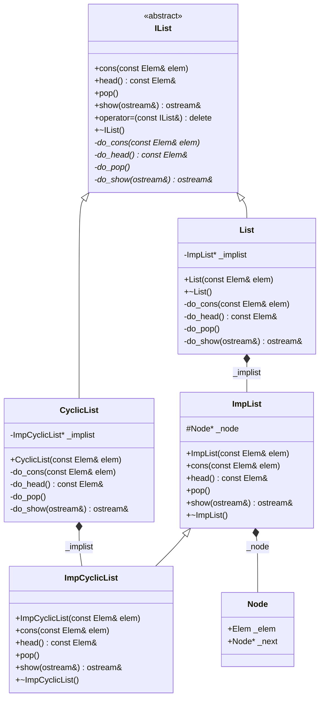

# 0.List Single_plus_CyclicList NVI Class Diagram

```mermaid
classDiagram
    class IList {
        <<abstract>>
        +cons(const Elem& elem)
        +head() const Elem&
        +pop()
        +show(ostream&) ostream&
        +operator=(const IList&) delete
        +~IList()
        -do_cons(const Elem& elem)*
        -do_head() const Elem&*
        -do_pop()*
        -do_show(ostream&) ostream&*
    }

    class List {
        -ImpList* _implist
        +List(const Elem& elem)
        +~List()
        -do_cons(const Elem& elem)
        -do_head() const Elem&
        -do_pop()
        -do_show(ostream&) ostream&
    }

    class CyclicList {
        -ImpCyclicList* _implist
        +CyclicList(const Elem& elem)
        -do_cons(const Elem& elem)
        -do_head() const Elem&
        -do_pop()
        -do_show(ostream&) ostream&
    }

    class ImpList {
        #Node* _node
        +ImpList(const Elem& elem)
        +cons(const Elem& elem)
        +head() const Elem&
        +pop()
        +show(ostream&) ostream&
        +~ImpList()
    }

    class ImpCyclicList {
        +ImpCyclicList(const Elem& elem)
        +cons(const Elem& elem)
        +head() const Elem&
        +pop()
        +show(ostream&) ostream&
        +~ImpCyclicList()
    }

    class Node {
        +Elem _elem
        +Node* _next
    }

    IList <|-- List
    IList <|-- CyclicList
    ImpList <|-- ImpCyclicList
    List *-- ImpList : _implist
    CyclicList *-- ImpCyclicList : _implist
    ImpList *-- Node : _node
```
