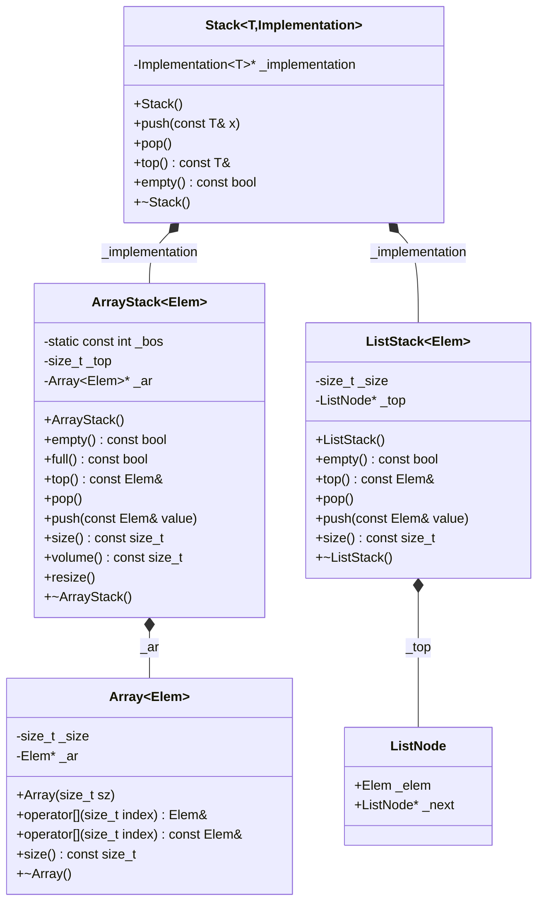

# 02 AggregatedStack Class Diagram

```mermaid
classDiagram
    class Stack~T,Implementation~ {
        -Implementation~T~* _implementation
        +Stack()
        +push(const T& x)
        +pop()
        +top() const T&
        +empty() const bool
        +~Stack()
    }

    class Array~Elem~ {
        -size_t _size
        -Elem* _ar
        +Array(size_t sz)
        +operator[](size_t index) Elem&
        +operator[](size_t index) const Elem&
        +size() const size_t
        +~Array()
    }

    class ArrayStack~Elem~ {
        -static const int _bos
        -size_t _top
        -Array~Elem~* _ar
        +ArrayStack()
        +empty() const bool
        +full() const bool
        +top() const Elem&
        +pop()
        +push(const Elem& value)
        +size() const size_t
        +volume() const size_t
        +resize()
        +~ArrayStack()
    }

    class ListStack~Elem~ {
        -size_t _size
        -ListNode* _top
        +ListStack()
        +empty() const bool
        +top() const Elem&
        +pop()
        +push(const Elem& value)
        +size() const size_t
        +~ListStack()
    }

    class ListNode {
        +Elem _elem
        +ListNode* _next
    }

    Stack~T,Implementation~ *-- ArrayStack~Elem~ : _implementation
    Stack~T,Implementation~ *-- ListStack~Elem~ : _implementation
    ArrayStack~Elem~ *-- Array~Elem~ : _ar
    ListStack~Elem~ *-- ListNode : _top
```
