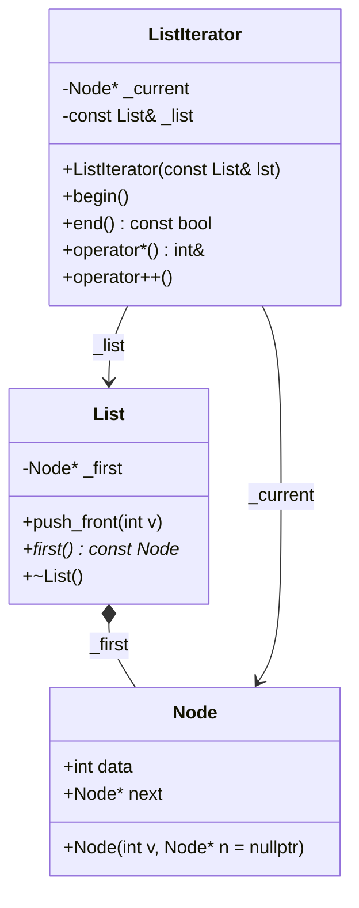

# 01 ListIterator Class Diagram

```mermaid
classDiagram
    class Node {
        +int data
        +Node* next
        +Node(int v, Node* n = nullptr)
    }

    class List {
        -Node* _first
        +push_front(int v)
        +first() const Node*
        +~List()
    }

    class ListIterator {
        -Node* _current
        -const List& _list
        +ListIterator(const List& lst)
        +begin()
        +end() const bool
        +operator*() int&
        +operator++()
    }

    List *-- Node : _first
    ListIterator --> List : _list
    ListIterator --> Node : _current
```
