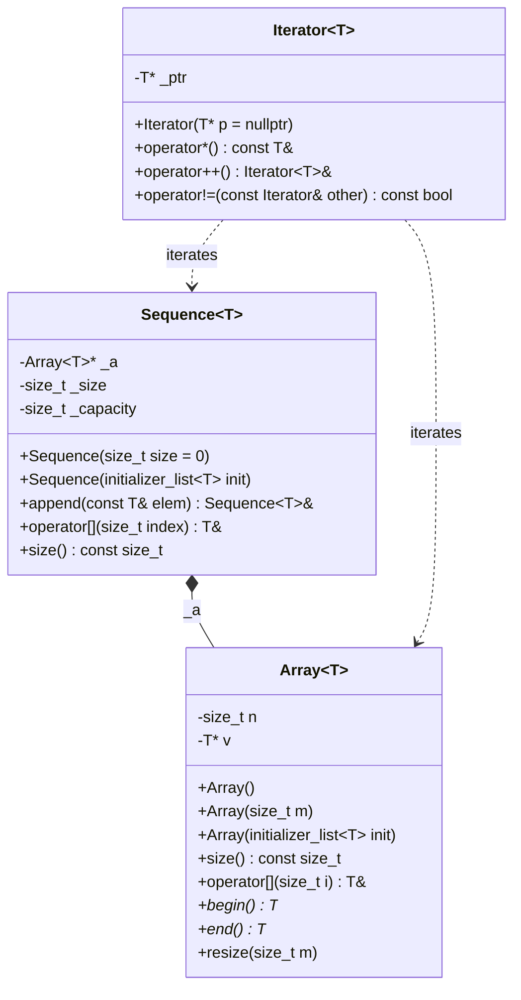

# 02 SimpleIterator Class Diagram

```mermaid
classDiagram
    class Iterator~T~ {
        -T* _ptr
        +Iterator(T* p = nullptr)
        +operator*() const T&
        +operator++() Iterator~T~&
        +operator!=(const Iterator& other) const bool
    }

    class Array~T~ {
        -size_t n
        -T* v
        +Array()
        +Array(size_t m)
        +Array(initializer_list~T~ init)
        +size() const size_t
        +operator[](size_t i) T&
        +begin() T*
        +end() T*
        +resize(size_t m)
    }

    class Sequence~T~ {
        -Array~T~* _a
        -size_t _size
        -size_t _capacity
        +Sequence(size_t size = 0)
        +Sequence(initializer_list~T~ init)
        +append(const T& elem) Sequence~T~&
        +operator[](size_t index) T&
        +size() const size_t
    }

    Sequence~T~ *-- Array~T~ : _a
    Iterator~T~ ..> Array~T~ : iterates
    Iterator~T~ ..> Sequence~T~ : iterates
```
