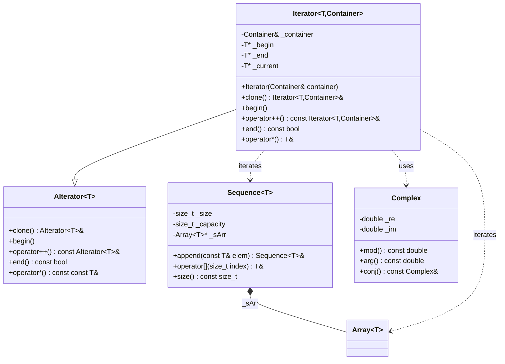

# 02a AbstractIterator Class Diagram

```mermaid
classDiagram
    class AIterator~T~ {
        +clone() AIterator~T~&
        +begin()
        +operator++() const AIterator~T~&
        +end() const bool
        +operator*() const const T&
    }

    class Iterator~T,Container~ {
        -Container& _container
        -T* _begin
        -T* _end
        -T* _current
        +Iterator(Container& container)
        +clone() Iterator~T,Container~&
        +begin()
        +operator++() const Iterator~T,Container~&
        +end() const bool
        +operator*() T&
    }

    class Array~T~
    class Array~T[n]~

    class Sequence~T~ {
        -size_t _size
        -size_t _capacity
        -Array~T~* _sArr
        +append(const T& elem) Sequence~T~&
        +operator[](size_t index) T&
        +size() const size_t
    }

    class Complex {
        -double _re
        -double _im
        +mod() const double
        +arg() const double
        +conj() const Complex&
    }

    Iterator~T,Container~ --|> AIterator~T~
    Sequence~T~ *-- Array~T~ : _sArr
    Iterator~T,Container~ ..> Array~T~ : iterates
    Iterator~T,Container~ ..> Sequence~T~ : iterates
    Iterator~T,Container~ ..> Complex : uses
```
