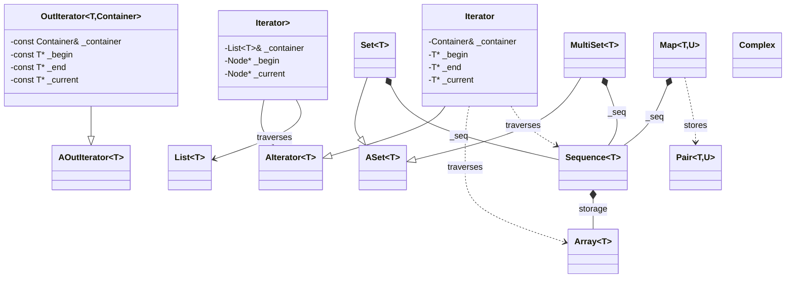

# 02b OutputItor Class Diagram

```mermaid
classDiagram
    class AIterator~T~
    class AOutIterator~T~

    class IteratorGeneric["Iterator<T, Container>"] {
        -Container& _container
        -T* _begin
        -T* _end
        -T* _current
    }

    class IteratorList["Iterator<T, List<T>>"] {
        -List~T~& _container
        -Node* _begin
        -Node* _current
    }

    class OutIterator~T,Container~ {
        -const Container& _container
        -const T* _begin
        -const T* _end
        -const T* _current
    }

    class Array~T~
    class Sequence~T~
    class List~T~
    class ASet~T~
    class Set~T~
    class MultiSet~T~
    class Map~T,U~
    class Pair~T,U~
    class Complex

    IteratorGeneric --|> AIterator~T~
    IteratorList --|> AIterator~T~
    OutIterator~T,Container~ --|> AOutIterator~T~
    Set~T~ --|> ASet~T~
    MultiSet~T~ --|> ASet~T~
    Sequence~T~ *-- Array~T~ : storage
    Set~T~ *-- Sequence~T~ : _seq
    MultiSet~T~ *-- Sequence~T~ : _seq
    Map~T,U~ *-- Sequence~T~ : _seq
    Map~T,U~ ..> Pair~T,U~ : stores
    IteratorList --> List~T~ : traverses
    IteratorGeneric ..> Array~T~ : traverses
    IteratorGeneric ..> Sequence~T~ : traverses
```
