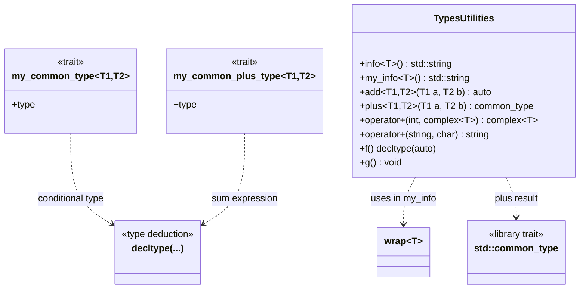

# 01 Types Class Diagram

```mermaid
classDiagram
    class wrap~T~

    class my_common_type~T1,T2~ {
        <<trait>>
        +type
    }

    class my_common_plus_type~T1,T2~ {
        <<trait>>
        +type
    }

    class TypesUtilities {
        +info~T~() std::string
        +my_info~T~() std::string
        +add~T1,T2~(T1 a, T2 b) auto
        +plus~T1,T2~(T1 a, T2 b) common_type
        +operator+(int, complex~T~) complex~T~
        +operator+(string, char) string
        +f() decltype(auto)
        +g() void
    }

    class std_common_type["std::common_type<T1, T2>"] {
        <<library trait>>
    }

    class decltype_expr["decltype(...)"] {
        <<type deduction>>
    }

    TypesUtilities ..> wrap~T~ : uses in my_info
    my_common_type~T1,T2~ ..> decltype_expr : conditional type
    my_common_plus_type~T1,T2~ ..> decltype_expr : sum expression
    TypesUtilities ..> std_common_type : plus result
```
