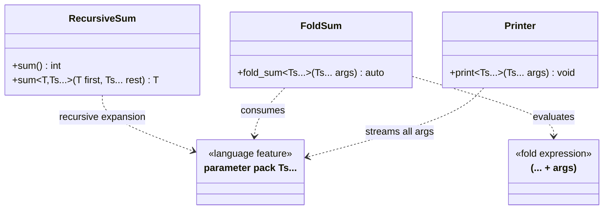

# 02 Fold Class Diagram

```mermaid
classDiagram
    class RecursiveSum {
        +sum() int
        +sum~T,Ts...~(T first, Ts... rest) T
    }

    class FoldSum {
        +fold_sum~Ts...~(Ts... args) auto
    }

    class Printer {
        +print~Ts...~(Ts... args) void
    }

    class VariadicPack["parameter pack Ts..."] {
        <<language feature>>
    }

    class LeftFold["(... + args)"] {
        <<fold expression>>
    }

    RecursiveSum ..> VariadicPack : recursive expansion
    FoldSum ..> VariadicPack : consumes
    FoldSum ..> LeftFold : evaluates
    Printer ..> VariadicPack : streams all args
```
