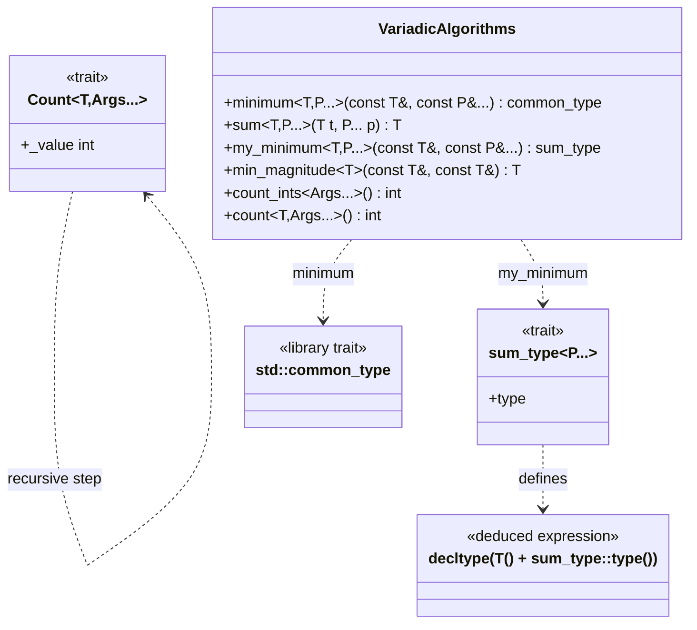

# 03 Variadic Class Diagram

```mermaid
classDiagram
    class sum_type~P...~ {
        <<trait>>
        +type
    }

    class Count~T,Args...~ {
        <<trait>>
        +_value int
    }

    class VariadicAlgorithms {
        +minimum~T,P...~(const T&, const P&...) common_type
        +sum~T,P...~(T t, P... p) T
        +my_minimum~T,P...~(const T&, const P&...) sum_type
        +min_magnitude~T~(const T&, const T&) T
        +count_ints~Args...~() int
        +count~T,Args...~() int
    }

    class std_common_type_pack["std::common_type<T, P...>"] {
        <<library trait>>
    }

    class sum_expr["decltype(T() + sum_type<P...>::type())"] {
        <<deduced expression>>
    }

    VariadicAlgorithms ..> std_common_type_pack : minimum
    VariadicAlgorithms ..> sum_type~P...~ : my_minimum
    Count~T,Args...~ ..> Count~T,Args...~ : recursive step
    sum_type~P...~ ..> sum_expr : defines
```
