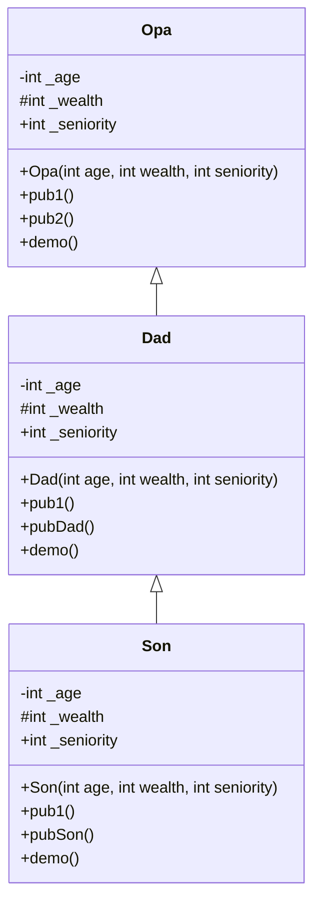

# 00 Inheritence Class Diagram

```mermaid
classDiagram
    class Opa {
        -int _age
        #int _wealth
        +int _seniority
        +Opa(int age, int wealth, int seniority)
        +pub1()
        +pub2()
        +demo()
    }

    class Dad {
        -int _age
        #int _wealth
        +int _seniority
        +Dad(int age, int wealth, int seniority)
        +pub1()
        +pubDad()
        +demo()
    }

    class Son {
        -int _age
        #int _wealth
        +int _seniority
        +Son(int age, int wealth, int seniority)
        +pub1()
        +pubSon()
        +demo()
    }

    Opa <|-- Dad
    Dad <|-- Son
```
