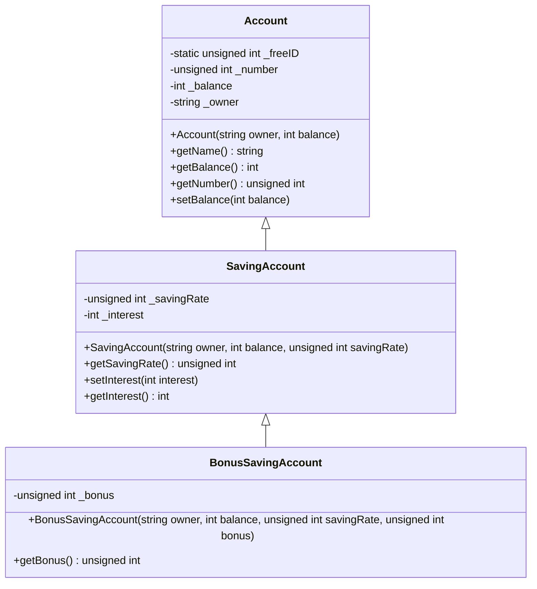

# 01 Account Class Diagram

```mermaid
classDiagram
    class Account {
        -static unsigned int _freeID
        -unsigned int _number
        -int _balance
        -string _owner
        +Account(string owner, int balance)
        +getName() string
        +getBalance() int
        +getNumber() unsigned int
        +setBalance(int balance)
    }

    class SavingAccount {
        -unsigned int _savingRate
        -int _interest
        +SavingAccount(string owner, int balance, unsigned int savingRate)
        +getSavingRate() unsigned int
        +setInterest(int interest)
        +getInterest() int
    }

    class BonusSavingAccount {
        -unsigned int _bonus
        +BonusSavingAccount(string owner, int balance, unsigned int savingRate, unsigned int bonus)
        +getBonus() unsigned int
    }

    Account <|-- SavingAccount
    SavingAccount <|-- BonusSavingAccount
```
