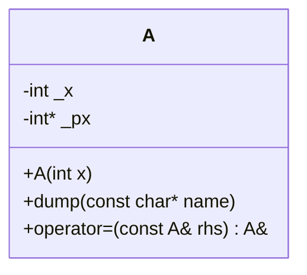

# 02 Assignment One Class Diagram

```mermaid
classDiagram
    class A {
        -int _x
        -int* _px
        +A(int x)
        +dump(const char* name)
        +operator=(const A& rhs) A&
    }
```
