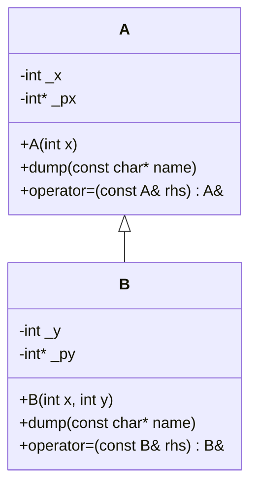

# 02 Assignment Assign Class Diagram

```mermaid
classDiagram
    class A {
        -int _x
        -int* _px
        +A(int x)
        +dump(const char* name)
        +operator=(const A& rhs) A&
    }

    class B {
        -int _y
        -int* _py
        +B(int x, int y)
        +dump(const char* name)
        +operator=(const B& rhs) B&
    }

    A <|-- B
```
