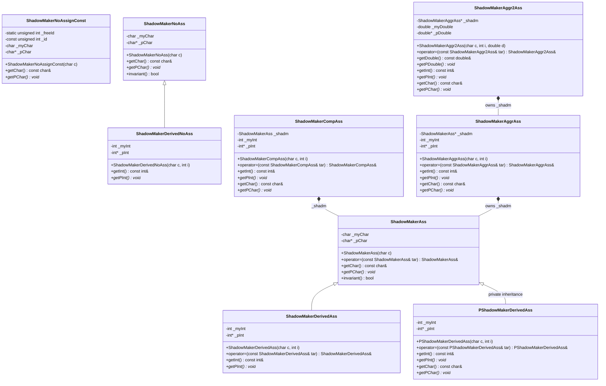

# 03 Aggregate Class Diagram

```mermaid
classDiagram
    class ShadowMakerNoAssignConst {
        -static unsigned int _freeId
        -const unsigned int _id
        -char _myChar
        -char* _pChar
        +ShadowMakerNoAssignConst(char c)
        +getChar() const char&
        +getPChar() void*
    }

    class ShadowMakerAss {
        -char _myChar
        -char* _pChar
        +ShadowMakerAss(char c)
        +operator=(const ShadowMakerAss& tar) ShadowMakerAss&
        +getChar() const char&
        +getPChar() void*
        +invariant() bool
    }

    class ShadowMakerDerivedAss {
        -int _myInt
        -int* _pInt
        +ShadowMakerDerivedAss(char c, int i)
        +operator=(const ShadowMakerDerivedAss& tar) ShadowMakerDerivedAss&
        +getInt() const int&
        +getPInt() void*
    }

    class ShadowMakerNoAss {
        -char _myChar
        -char* _pChar
        +ShadowMakerNoAss(char c)
        +getChar() const char&
        +getPChar() void*
        +invariant() bool
    }

    class ShadowMakerDerivedNoAss {
        -int _myInt
        -int* _pInt
        +ShadowMakerDerivedNoAss(char c, int i)
        +getInt() const int&
        +getPInt() void*
    }

    class PShadowMakerDerivedAss {
        -int _myInt
        -int* _pInt
        +PShadowMakerDerivedAss(char c, int i)
        +operator=(const PShadowMakerDerivedAss& tar) PShadowMakerDerivedAss&
        +getInt() const int&
        +getPInt() void*
        +getChar() const char&
        +getPChar() void*
    }

    class ShadowMakerCompAss {
        -ShadowMakerAss _shadm
        -int _myInt
        -int* _pInt
        +ShadowMakerCompAss(char c, int i)
        +operator=(const ShadowMakerCompAss& tar) ShadowMakerCompAss&
        +getInt() const int&
        +getPInt() void*
        +getChar() const char&
        +getPChar() void*
    }

    class ShadowMakerAggrAss {
        -ShadowMakerAss* _shadm
        -int _myInt
        -int* _pInt
        +ShadowMakerAggrAss(char c, int i)
        +operator=(const ShadowMakerAggrAss& tar) ShadowMakerAggrAss&
        +getInt() const int&
        +getPInt() void*
        +getChar() const char&
        +getPChar() void*
    }

    class ShadowMakerAggr2Ass {
        -ShadowMakerAggrAss* _shadm
        -double _myDouble
        -double* _pDouble
        +ShadowMakerAggr2Ass(char c, int i, double d)
        +operator=(const ShadowMakerAggr2Ass& tar) ShadowMakerAggr2Ass&
        +getDouble() const double&
        +getPDouble() void*
        +getInt() const int&
        +getPInt() void*
        +getChar() const char&
        +getPChar() void*
    }

    ShadowMakerAss <|-- ShadowMakerDerivedAss
    ShadowMakerNoAss <|-- ShadowMakerDerivedNoAss
    ShadowMakerAss <|-- PShadowMakerDerivedAss : private inheritance
    ShadowMakerCompAss *-- ShadowMakerAss : _shadm
    ShadowMakerAggrAss *-- ShadowMakerAss : owns _shadm
    ShadowMakerAggr2Ass *-- ShadowMakerAggrAss : owns _shadm
```
