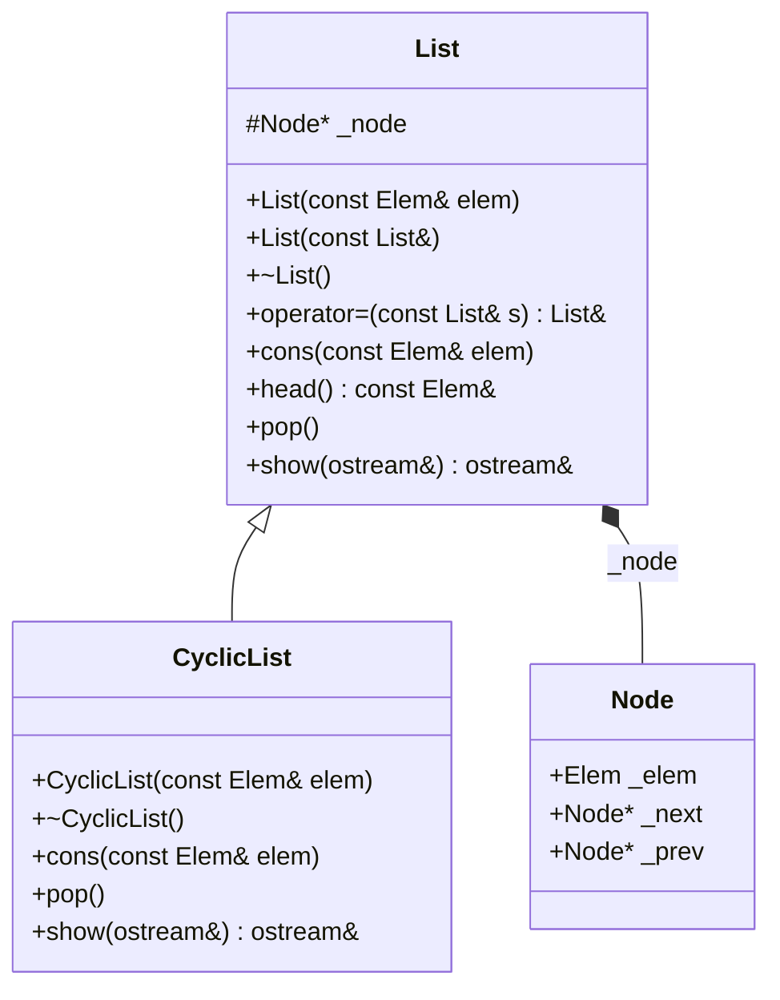

# 04 CyclicList Class Diagram

```mermaid
classDiagram
    class List {
        #Node* _node
        +List(const Elem& elem)
        +List(const List&)
        +~List()
        +operator=(const List& s) List&
        +cons(const Elem& elem)
        +head() const Elem&
        +pop()
        +show(ostream&) ostream&
    }

    class Node {
        +Elem _elem
        +Node* _next
        +Node* _prev
    }

    class CyclicList {
        +CyclicList(const Elem& elem)
        +~CyclicList()
        +cons(const Elem& elem)
        +pop()
        +show(ostream&) ostream&
    }

    List <|-- CyclicList
    List *-- Node : _node
```
